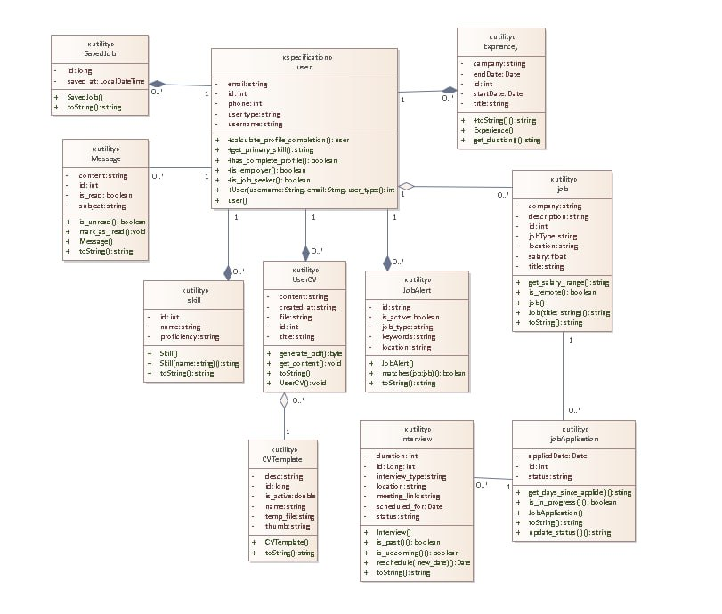

# Phase 2 Report: System Design & Code Engineering

## 1. Project Overview

**System**: Jobify - Job Portal Platform  
**Date**: December 23, 2024  
**Tools**: Enterprise Architect 15.2, Java JDK 11, Git

## 2. Forward Engineering Process

### 2.1 Class Diagram Creation

**Diagram Components:**

- 12 classes with complete attributes and methods
- Proper UML relationships with multiplicity
- Composition, Aggregation, Association relationships

### 2.2 Code Generation

**Generated Classes:**

- User, Skill, Experience, Education, Job, JobApplication
- Interview, SavedJob, CVTemplate, UserCV, Message, JobAlert

**Generation Settings:**

- Language: Java
- Output: `src/main/java/com/jobify/models/`
- Options: Generate getters/setters
